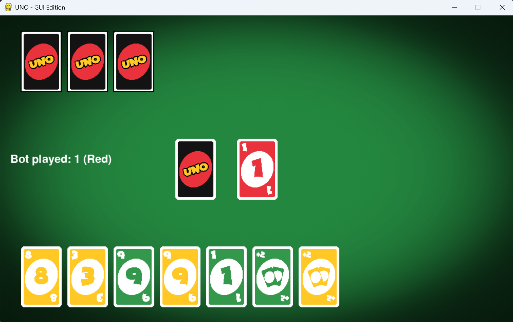

# UNO AI Bot

A Python implementation of the classic UNO card game with both GUI and CLI modes. Play against a smart AI bot with multiple difficulty levels!



## Features

- Play UNO in a graphical interface (GUI) or in the terminal (CLI)
- AI bot with three difficulty levels: Random, Smart, and Monte Carlo
- Realistic UNO rules, including special cards (Skip, Reverse, Draw Two, Wild, Wild Draw Four)
- Game history tracking and pandas DataFrame export
- Colorful card graphics and smooth gameplay

## How to Run

### Requirements

- Python 3.8+
- `pygame`
- `pandas`

Install dependencies:

```bash
pip install -r requirements.txt
```

### Start the GUI Game

```bash
python gui_game.py
```

### Start the CLI Game

```bash
python cli_game.py
```

## Running tests

This project includes a small pytest suite located at `tests/test_uno.py` that exercises core game logic (cards, players, strategies, and basic game flows).

Quick way (recommended): use the provided helper script which creates a virtual environment, installs requirements (including `pytest`), and runs the tests:

```bash
./run_tests.sh
```

Manual steps:

```bash
python -m venv .venv
source .venv/bin/activate    # on Windows PowerShell use: .venv\\Scripts\\Activate.ps1
pip install --upgrade pip
pip install -r requirements.txt
pytest -q
```

Notes:

- `pytest` has been added to `requirements.txt`.
- Tests may rely on random shuffles in the game engine; if you need fully deterministic tests I can update them to seed the RNG or construct deterministic decks.

## Controls (GUI)

- Click on a card to play it
- Click the deck to draw a card
- Click "End Turn" if you cannot play after drawing
- Choose a color for wild cards via popup

## TODO

- Develop a Reinforcement Learning (RL) Model as an added method in Strategy Class
- Develop an XGBoost Model as an added method in Strategy Class

## Credits

- UNO card graphics by [alexder on itch.io](https://alexder.itch.io/uno-card-game-asset-pack?download)

## License

This project is for educational purposes. Please respect the original asset creator's license for the card images.
